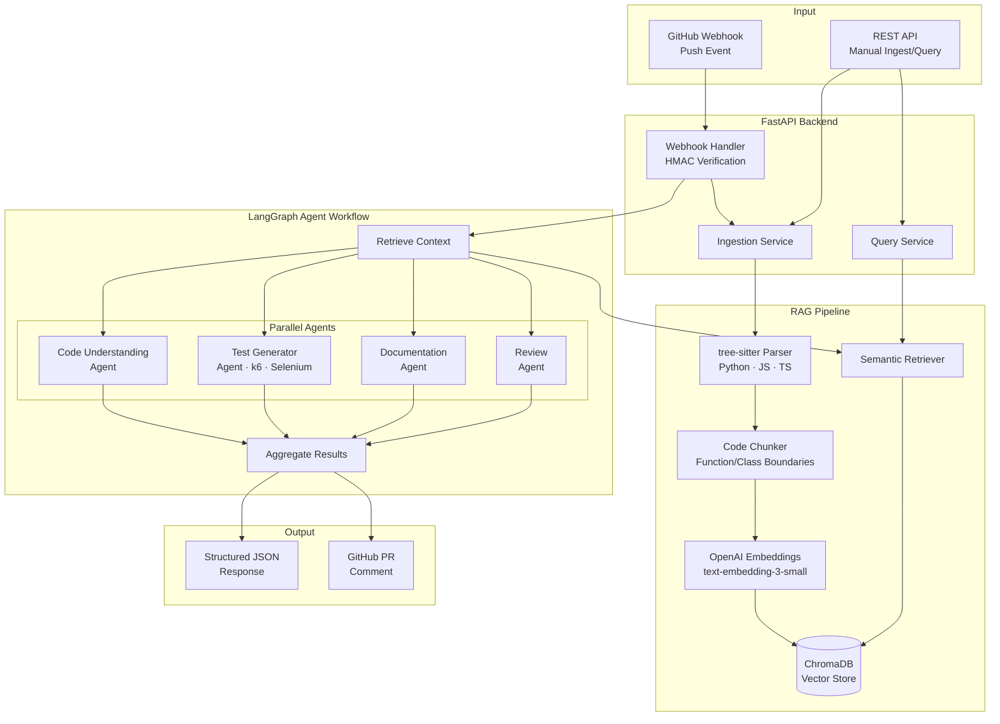

# DevPilot AI

**AI Codebase Intelligence Agent** — A production-ready RAG + Multi-Agent system that analyzes GitHub repositories, understands code changes, and generates tests, documentation, and code reviews automatically.

## Architecture



## Features

- **Intelligent Code Parsing** — tree-sitter-based AST parsing for Python, JavaScript, and TypeScript. Extracts functions, classes, and methods with metadata.
- **RAG-Powered Retrieval** — Semantic search over your codebase using ChromaDB and OpenAI embeddings.
- **4 Specialized Agents** orchestrated via LangGraph:
  - **Code Understanding** — Explains changes and analyzes impact
  - **Test Generator** — Creates k6 performance tests and Selenium UI tests
  - **Documentation** — Generates/updates README and API docs
  - **Code Review** — Detects bugs, security issues, and suggests improvements
- **GitHub Integration** — Webhook-driven pipeline with HMAC signature verification and PR comment posting.
- **Multi-LLM Support** — Configurable provider (OpenAI, Anthropic) via environment variables.
- **Async Processing** — Non-blocking webhook handling with background tasks.

## Quick Start

### 1. Clone & Configure

```bash
git clone https://github.com/your-org/devpilot-ai.git
cd devpilot-ai
cp .env.example .env
# Edit .env with your API keys
```

### 2. Run with Docker

```bash
docker-compose up --build
```

### 3. Run Locally

```bash
python -m venv .venv
source .venv/bin/activate  # Windows: .venv\Scripts\activate
pip install -r requirements.txt
uvicorn app.main:app --reload
```

The API is available at `http://localhost:8000`.

## API Endpoints

| Method | Path | Description |
|--------|------|-------------|
| `GET` | `/health` | Health check |
| `POST` | `/api/ingest` | Ingest a full GitHub repository |
| `POST` | `/api/query` | Semantic search over ingested codebase |
| `POST` | `/api/webhook/github` | Receive GitHub push webhooks |

### Ingest a Repository

```bash
curl -X POST http://localhost:8000/api/ingest \
  -H "Content-Type: application/json" \
  -d '{"repo_url": "https://github.com/owner/repo", "branch": "main"}'
```

### Query the Codebase

```bash
curl -X POST http://localhost:8000/api/query \
  -H "Content-Type: application/json" \
  -d '{"query": "How does authentication work?", "repo": "owner/repo", "top_k": 10}'
```

### GitHub Webhook Setup

1. Go to your repo → Settings → Webhooks → Add webhook
2. **Payload URL:** `https://your-domain.com/api/webhook/github`
3. **Content type:** `application/json`
4. **Secret:** Same as `GITHUB_WEBHOOK_SECRET` in your `.env`
5. **Events:** Select "Just the push event"

## Environment Variables

| Variable | Default | Description |
|----------|---------|-------------|
| `LLM_PROVIDER` | `openai` | LLM provider (`openai` \| `anthropic`) |
| `LLM_MODEL` | `gpt-4o` | Model name |
| `OPENAI_API_KEY` | — | OpenAI API key |
| `ANTHROPIC_API_KEY` | — | Anthropic API key (if using Anthropic) |
| `EMBEDDING_MODEL` | `text-embedding-3-small` | Embedding model |
| `GITHUB_TOKEN` | — | GitHub personal access token |
| `GITHUB_WEBHOOK_SECRET` | — | Webhook HMAC secret |
| `CHROMA_PERSIST_DIR` | `./data/chroma` | ChromaDB storage path |
| `LOG_LEVEL` | `INFO` | Logging level |

## Project Structure

```
app/
├── main.py                          # FastAPI app, lifespan, CORS
├── config.py                        # Pydantic Settings
├── api/
│   ├── dependencies.py              # DI (Settings, ChromaDB, LLM)
│   └── routes/
│       ├── health.py                # GET /health
│       ├── ingest.py                # POST /api/ingest
│       ├── query.py                 # POST /api/query
│       └── webhook.py               # POST /api/webhook/github
├── core/
│   ├── llm.py                       # Multi-provider LLM factory
│   ├── logging.py                   # structlog configuration
│   └── formatting.py                # PR comment Markdown formatter
├── models/
│   └── schemas.py                   # Pydantic request/response models
└── services/
    ├── github/
    │   ├── client.py                # Async GitHub REST API client
    │   ├── parser.py                # tree-sitter code parser
    │   └── webhook_handler.py       # Push event processing
    ├── rag/
    │   ├── chunker.py               # Code-aware document chunking
    │   ├── embeddings.py            # OpenAI embedding wrapper
    │   ├── vectorstore.py           # ChromaDB CRUD operations
    │   └── retriever.py             # Semantic retrieval + context
    └── agents/
        ├── state.py                 # LangGraph TypedDict state
        ├── graph.py                 # StateGraph with parallel agents
        ├── code_understanding.py    # Code explainer agent
        ├── test_generator.py        # k6 + Selenium test agent
        ├── documentation.py         # Documentation updater agent
        └── review.py                # Code review agent
```

## Running Tests

```bash
pip install -e ".[dev]"
pytest tests/ -v
```

## License

MIT
