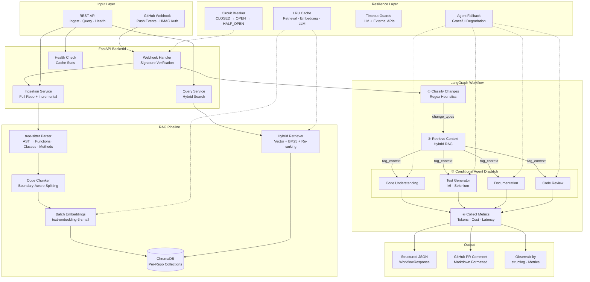
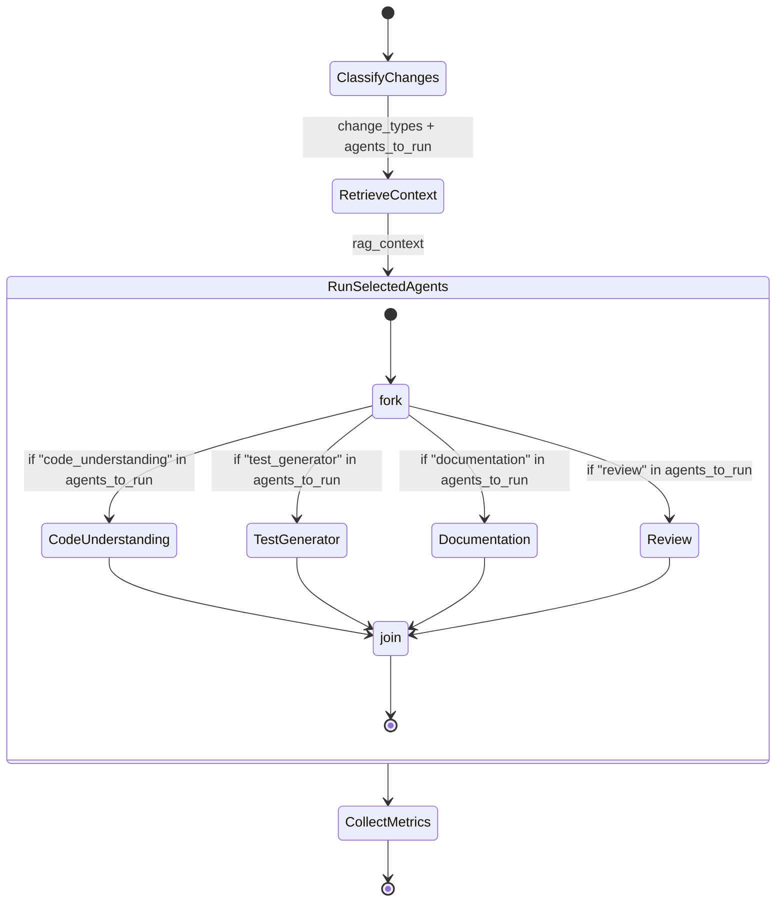
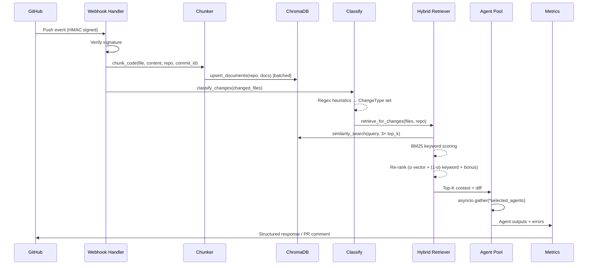

# DevPilot AI

**AI-Powered Codebase Intelligence Agent** — A production-grade system that combines **RAG (Retrieval-Augmented Generation)**, **conditional multi-agent orchestration**, and **GitHub integration** to automatically analyze code changes, generate tests, update documentation, and perform code reviews.

Built with **FastAPI**, **LangChain**, **LangGraph**, **ChromaDB**, and **OpenAI** — designed to demonstrate real-world AI agent architecture with interview-ready system design.

---

## System Architecture

### High-Level Overview



### Agent Workflow — Conditional Routing (LangGraph)

This is the core intelligence of the system. Unlike a naive pipeline that runs all agents on every change, DevPilot **classifies changes first** and **routes to only the relevant agents**:



**Routing Table** — What runs for each change type:

| Change Type | Agents Invoked | Example Files |
|-------------|----------------|---------------|
| `api` | understanding + test_gen + review | `routes/users.py`, `controller.ts` |
| `logic` | understanding + review | `utils/math.py`, `services/billing.js` |
| `ui` | test_gen (Selenium) + review | `App.tsx`, `styles.css` |
| `config` | documentation + review | `Dockerfile`, `settings.yaml` |
| `schema` | documentation + review + understanding | `models/user.py`, `migration/` |
| `docs` | documentation only | `README.md`, `CHANGELOG.md` |
| `test` | review only | `test_login.py`, `spec/auth.ts` |
| `unknown` | all four agents | Fallback for unrecognized patterns |

### Data Flow — Webhook to Response



### Hybrid Search Pipeline

The retriever implements a three-stage pipeline to balance **semantic understanding** with **exact identifier matching**:

```
  Query: "How does calculateTax work?"
                    │
          ┌─────────┴─────────┐
          │                   │
    Vector Search          Keyword Search
    (ChromaDB)              (BM25-style)
    Semantic meaning        Exact identifiers
    "tax computation"       "calculateTax"
          │                   │
          └─────────┬─────────┘
                    │
              Re-Ranking
        α·vector_rank + (1-α)·keyword_score + metadata_bonus
        (function/class name match → +0.3 bonus)
                    │
              Top-K Results
```

- **α = 0.7** (default) — weighted toward vector similarity
- Over-fetches **3× top_k** candidates from ChromaDB, then re-ranks to final top_k
- Results cached in LRU with TTL to avoid redundant vector DB queries

---

## Design Decisions

### Why RAG Instead of Full-Context LLM?

| Approach | Pros | Cons |
|----------|------|------|
| **Full context** | Simple, no retrieval step | Token limits (~128K), cost scales linearly, no incremental updates |
| **RAG (chosen)** | Scales to large repos, cost-efficient (only relevant chunks sent), incremental updates via webhooks | Retrieval quality matters, needs embedding maintenance |

DevPilot uses RAG because real codebases (10K+ files) exceed context windows. The hybrid retriever mitigates classic RAG failure modes (missed identifier matches) via BM25 keyword scoring.

### Why LangGraph Over a Simple Pipeline?

A sequential pipeline (chunk → embed → run all agents) wastes compute. LangGraph provides:

1. **Conditional routing** — Only relevant agents execute per change type
2. **Parallel fan-out** — Selected agents run via `asyncio.gather`, not sequentially
3. **Typed state** — `AgentState` TypedDict enforces data contracts between nodes
4. **Metrics at boundaries** — Each node boundary is a natural instrumentation point

### Why ChromaDB?

| Vector DB | Ops Complexity | Python-Native | Persistence | Production Path |
|-----------|---------------|---------------|-------------|-----------------|
| ChromaDB (chosen) | Zero (embedded) | Yes | File-based | Client-server mode or migrate to Pinecone |
| Pinecone | Managed SaaS | SDK | Cloud | Already production |
| Weaviate | Self-hosted | SDK | Docker | Kubernetes deployment |

ChromaDB gives zero-ops local development with a clear migration path. Per-repo collection isolation prevents cross-contamination.

### Why tree-sitter for Parsing?

- **Language-agnostic AST** — Same API for Python, JS, TS (extensible to Go, Rust, Java)
- **Boundary-aware chunking** — Splits at function/class boundaries, not arbitrary token counts
- **Metadata extraction** — Function names, class names, line ranges flow into vector store metadata for re-ranking

### Resilience Strategy

```
External Call (LLM / GitHub API)
        │
   ┌────┴────┐
   │ Timeout │ ← with_timeout(coro, seconds)
   └────┬────┘
   ┌────┴──────────┐
   │ Circuit Breaker│ ← CLOSED → OPEN (after N failures) → HALF_OPEN (probe)
   └────┬──────────┘
   ┌────┴──────────┐
   │ Agent Fallback │ ← @agent_fallback returns default on ANY exception
   └────┬──────────┘
        │
   Graceful response (never crashes the workflow)
```

Every agent is wrapped with `@agent_fallback` — if an LLM call fails, the workflow continues with a default value and records the error in metrics. The circuit breaker prevents cascading failures when an external service is down.

---

## Features

### Core Intelligence
- **Conditional Agent Routing** — Classifies changes by type (API, logic, UI, config, schema, docs, test) and dispatches only the relevant agents
- **Hybrid RAG Retrieval** — Vector similarity + BM25 keyword matching + metadata re-ranking with configurable alpha blending
- **4 Specialized Agents** orchestrated via LangGraph StateGraph:
  - **Code Understanding** — Explains changes, analyzes blast radius, grounded in actual diff + context
  - **Test Generator** — Creates k6 load tests (API changes) and Selenium UI tests (UI changes)
  - **Documentation** — Generates/updates docs with anti-hallucination guardrails
  - **Code Review** — Detects bugs, security issues, performance problems; flags only real issues visible in the diff

### Production Infrastructure
- **AST-Aware Code Parsing** — tree-sitter for Python, JavaScript, TypeScript (function/class boundary chunking)
- **Batched Embedding** — Configurable batch size prevents OOM on large repositories
- **LRU Caching with TTL** — Three-tier cache (retrieval, embedding, LLM) with hit rate tracking
- **Circuit Breaker** — CLOSED → OPEN → HALF_OPEN state machine for GitHub API / LLM resilience
- **Agent Fallback Decorators** — Graceful degradation; no single agent failure crashes the pipeline
- **Timeout Guards** — Configurable per-operation timeouts for all external calls
- **Per-Request Metrics** — Token usage, cost estimation, latency breakdown, retrieval hit rate
- **Structured Logging** — JSON-formatted structured logs via structlog
- **Multi-LLM Support** — Swap between OpenAI (gpt-4o) and Anthropic (Claude) via config
- **GitHub Webhook Integration** — HMAC-SHA256 signature verification, incremental embedding updates

---

## Quick Start

### 1. Clone & Configure

```bash
git clone https://github.com/your-org/devpilot-ai.git
cd devpilot-ai
cp .env.example .env
# Edit .env with your API keys
```

### 2. Run with Docker

```bash
docker-compose up --build
```

### 3. Run Locally

```bash
python -m venv .venv
source .venv/bin/activate  # Windows: .venv\Scripts\activate
pip install -r requirements.txt
uvicorn app.main:app --reload
```

The API is available at `http://localhost:8000`.

---

## API Reference

| Method | Path | Description |
|--------|------|-------------|
| `GET` | `/health` | Health check + cache stats |
| `POST` | `/api/ingest` | Ingest a full GitHub repository |
| `POST` | `/api/query` | Hybrid semantic search over ingested codebase |
| `POST` | `/api/webhook/github` | Receive GitHub push webhooks |

### Ingest a Repository

```bash
curl -X POST http://localhost:8000/api/ingest \
  -H "Content-Type: application/json" \
  -d '{"repo_url": "https://github.com/owner/repo", "branch": "main"}'
```

### Query the Codebase

```bash
curl -X POST http://localhost:8000/api/query \
  -H "Content-Type: application/json" \
  -d '{
    "query": "How does authentication work?",
    "repo": "owner/repo",
    "top_k": 10,
    "filter_language": "python"
  }'
```

### Health Check (with cache observability)

```bash
curl http://localhost:8000/health
```

```json
{
  "status": "ok",
  "version": "0.2.0",
  "environment": "development",
  "caches": {
    "retrieval_cache": { "size": 42, "hits": 156, "misses": 23, "hit_rate": 0.871 },
    "embedding_cache": { "size": 1203, "hits": 4521, "misses": 89, "hit_rate": 0.981 },
    "llm_cache": { "size": 12, "hits": 34, "misses": 8, "hit_rate": 0.81 }
  }
}
```

### GitHub Webhook Setup

1. Go to your repo → Settings → Webhooks → Add webhook
2. **Payload URL:** `https://your-domain.com/api/webhook/github`
3. **Content type:** `application/json`
4. **Secret:** Same as `GITHUB_WEBHOOK_SECRET` in your `.env`
5. **Events:** Select "Just the push event"

### Example Workflow Response

When a push event triggers the agent workflow, you get a structured response with routing decisions, agent outputs, and metrics:

```json
{
  "repo": "owner/repo",
  "branch": "main",
  "changed_files": [
    { "filename": "src/routes/users.py", "status": "modified" }
  ],
  "change_types": ["api"],
  "agents_used": ["code_understanding", "test_generator", "review"],
  "routing_reasoning": "Detected change types: ['api']. Routing to agents: ['code_understanding', 'review', 'test_generator'].",
  "code_understanding": {
    "summary": "Modified user registration endpoint to add email validation",
    "details": ["Added regex email validator in create_user()"],
    "impact": "All registration API consumers will now get 422 on invalid emails"
  },
  "test_suggestions": [
    {
      "test_type": "k6",
      "file_name": "tests/load/test_registration.js",
      "description": "Load test for user registration with email validation",
      "code": "import http from 'k6/http'; ..."
    }
  ],
  "review_findings": [
    {
      "severity": "warning",
      "category": "security",
      "file_path": "src/routes/users.py",
      "line": 42,
      "message": "Email regex may be vulnerable to ReDoS",
      "suggestion": "Use a compiled regex with re2 or limit input length"
    }
  ],
  "metrics": {
    "request_id": "abc123def",
    "total_input_tokens": 3420,
    "total_output_tokens": 1105,
    "total_cost_usd": 0.0234,
    "total_latency_ms": 4521.3,
    "retrieval_chunks": 15,
    "retrieval_hit_rate": 1.0,
    "agents_invoked": ["code_understanding", "test_generator", "review"]
  },
  "errors": []
}
```

---

## Configuration

### Environment Variables

| Variable | Default | Description |
|----------|---------|-------------|
| **LLM** | | |
| `LLM_PROVIDER` | `openai` | LLM provider (`openai` \| `anthropic`) |
| `LLM_MODEL` | `gpt-4o` | Model name |
| `LLM_TEMPERATURE` | `0.1` | Generation temperature |
| `OPENAI_API_KEY` | — | OpenAI API key |
| `ANTHROPIC_API_KEY` | — | Anthropic API key |
| **Embeddings** | | |
| `EMBEDDING_MODEL` | `text-embedding-3-small` | Embedding model |
| `EMBEDDING_BATCH_SIZE` | `100` | Documents per embedding batch |
| **GitHub** | | |
| `GITHUB_TOKEN` | — | Personal access token |
| `GITHUB_WEBHOOK_SECRET` | — | Webhook HMAC secret |
| **RAG** | | |
| `RAG_TOP_K` | `15` | Initial retrieval candidates |
| `RAG_RERANK_TOP_K` | `8` | Final results after re-ranking |
| `RAG_HYBRID_ALPHA` | `0.7` | Vector vs keyword weight (0=keyword, 1=vector) |
| **Caching** | | |
| `CACHE_TTL_SECONDS` | `300` | Default cache TTL |
| `CACHE_MAX_SIZE` | `1000` | Max entries per cache tier |
| **Resilience** | | |
| `LLM_TIMEOUT_SECONDS` | `120` | Per-call LLM timeout |
| `GITHUB_CIRCUIT_BREAKER_THRESHOLD` | `5` | Failures before circuit opens |
| `GITHUB_CIRCUIT_BREAKER_RECOVERY` | `60` | Seconds before half-open probe |
| **App** | | |
| `CHROMA_PERSIST_DIR` | `./data/chroma` | ChromaDB storage path |
| `LOG_LEVEL` | `INFO` | Logging level |
| `APP_ENV` | `development` | Environment tag |

---

## Project Structure

```
app/
├── main.py                           # FastAPI app, lifespan, CORS
├── config.py                         # Pydantic Settings (all config above)
├── api/
│   ├── dependencies.py               # Dependency injection
│   └── routes/
│       ├── health.py                 # GET /health (+ cache stats)
│       ├── ingest.py                 # POST /api/ingest
│       ├── query.py                  # POST /api/query (hybrid search)
│       └── webhook.py                # POST /api/webhook/github
├── agents/
│   ├── state.py                      # LangGraph TypedDict + ChangeType enum
│   ├── graph.py                      # StateGraph: classify → retrieve → route → metrics
│   ├── code_understanding.py         # Code analysis agent (@agent_fallback)
│   ├── test_generator.py             # k6 + Selenium test agent (@agent_fallback)
│   ├── documentation.py              # Documentation agent (@agent_fallback)
│   └── review.py                     # Code review agent (@agent_fallback)
├── rag/
│   ├── chunker.py                    # AST-aware chunking with commit_id tracking
│   ├── embeddings.py                 # OpenAI embedding wrapper
│   ├── vectorstore.py                # ChromaDB: batched upsert, per-repo collections
│   └── retriever.py                  # Hybrid search: vector + BM25 + re-ranking + cache
├── services/
│   ├── client.py                     # Async GitHub REST API client (httpx)
│   ├── parser.py                     # tree-sitter AST parser (Python/JS/TS)
│   └── webhook_handler.py            # Push event processing + incremental updates
├── models/
│   └── schemas.py                    # Pydantic request/response models
└── utils/
    ├── cache.py                      # LRU cache with TTL (3 tiers)
    ├── errors.py                     # Exception hierarchy + circuit breaker + fallback
    ├── metrics.py                    # Token counting, cost estimation, latency tracking
    ├── llm.py                        # Multi-provider LLM factory (OpenAI / Anthropic)
    ├── logging.py                    # structlog JSON configuration
    └── formatting.py                 # PR comment Markdown formatter

tests/
├── conftest.py                       # Shared fixtures
├── test_api/                         # API endpoint tests
│   ├── test_ingest.py
│   ├── test_query.py
│   └── test_webhook.py
├── test_core/                        # Core module tests
│   ├── test_cache.py                 # LRU cache + TTL + eviction
│   ├── test_errors.py                # Circuit breaker + fallback + timeout
│   └── test_metrics.py               # Token counting + cost + RequestMetrics
└── test_services/                    # Service tests
    ├── test_agents.py                # Agent execution + fallback behavior
    ├── test_chunker.py               # tree-sitter chunking + commit_id
    ├── test_graph.py                 # Routing table + change classification
    └── test_retriever.py             # Hybrid search + re-ranking + keyword scoring

docker/
├── Dockerfile                        # Multi-stage Python build
└── docker-compose.yml                # Production compose with healthcheck
```

---

## Running Tests

```bash
pip install -r requirements.txt
pytest tests/ -v
```

---

## Tech Stack

| Layer | Technology | Why |
|-------|-----------|-----|
| API | FastAPI + Uvicorn | Async-native, auto OpenAPI docs, dependency injection |
| Agent Orchestration | LangGraph (StateGraph) | Conditional routing, typed state, parallel execution |
| LLM | LangChain (OpenAI / Anthropic) | Provider abstraction, prompt templating, structured output |
| Vector Store | ChromaDB | Zero-ops embedded mode, file persistence, per-collection isolation |
| Embeddings | OpenAI text-embedding-3-small | Strong code understanding, 1536 dimensions, low cost |
| Code Parsing | tree-sitter | Language-agnostic AST, boundary-aware chunking, metadata extraction |
| Caching | Custom LRU + TTL | No Redis dependency for single-process; three-tier (retrieval, embedding, LLM) |
| Logging | structlog | JSON structured logs, context binding, production-ready |
| Config | pydantic-settings | Type-safe env vars, `.env` file support, validation |
| HTTP | httpx | Async GitHub API calls with connection pooling |
| Containerization | Docker + docker-compose | One-command deployment |

---

## License

MIT
