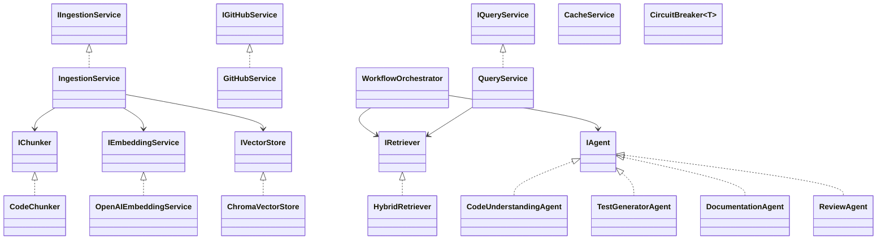
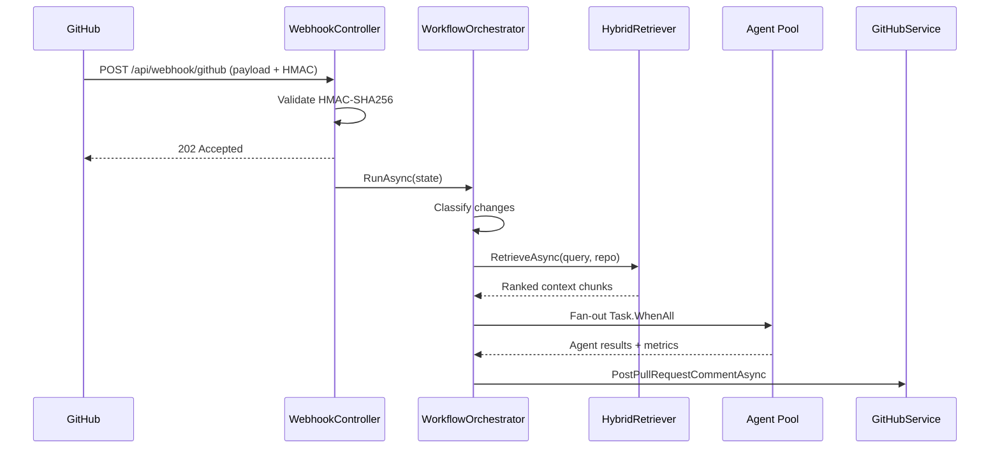
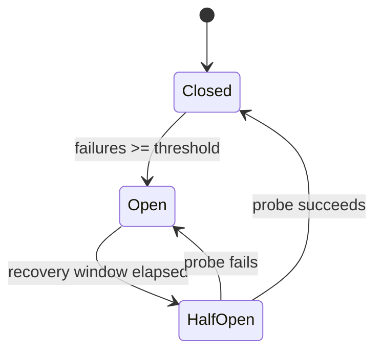
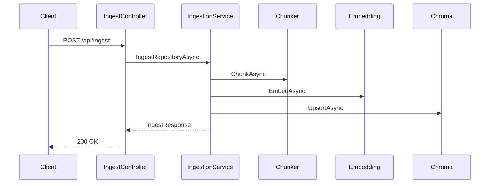
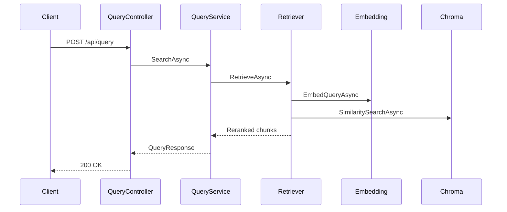
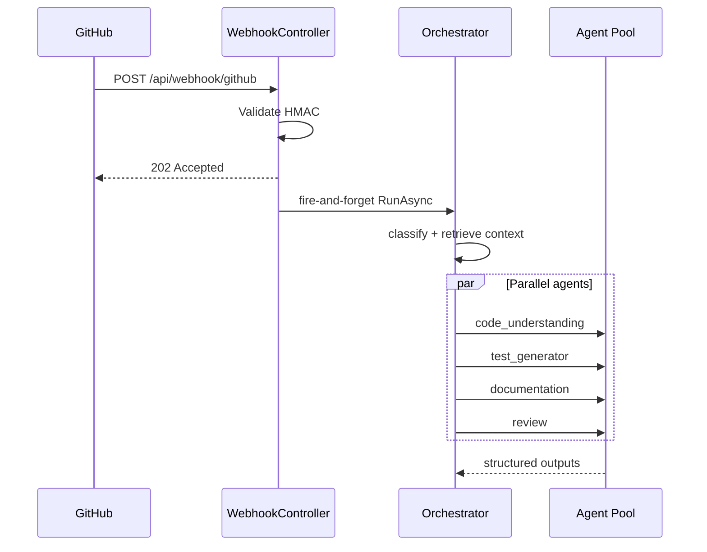

# DevPilot AI (.NET 8 Migration)

## 1. Project Title + Badges


## 2. What It Does
DevPilot AI is an AI-assisted code intelligence service for GitHub repositories. It ingests repository code, builds semantic retrieval context, and reacts to webhook push events with specialized analysis agents. The system posts actionable engineering feedback by routing only relevant agents for each change type.

## 3. High-Level Design (HLD)

```text
GitHub Push Event
      |
      v
Webhook Handler (HMAC verify)
      |
      v
Workflow Orchestrator
      |
      +-------------------------------+
      |            |        |         |
      v            v        v         v
Code Understanding Test Gen Docs    Review
      \            |        |         /
       +-----------+--------+--------+
                   |
                   v
         GitHub PR Comment Publisher
```

### API Layer
The API layer is implemented with ASP.NET Core Web API using minimal hosting and controller endpoints. It applies API key authentication through middleware, endpoint-specific rate limiting via sliding window policies, structured Serilog JSON logging, and OpenAPI documentation with API-key security definitions.

### RAG Pipeline
The RAG pipeline transforms source files into semantically meaningful chunks, embeds them with OpenAI-compatible embedding APIs, stores vectors in ChromaDB, and retrieves context with hybrid vector + BM25 re-ranking. This reduces token usage and improves relevance for agent prompts.

### Agent System
The agent subsystem is built around a Workflow Orchestrator and four domain-specific agents (code understanding, test generation, documentation, and review). It classifies changed files, retrieves context, dispatches agents in parallel, and safely degrades if one agent fails.

### Infrastructure
Infrastructure services include a generic circuit breaker, tiered in-memory caching with hit-rate metrics, request-level token/cost/latency accounting, and resilient service wrappers for external dependencies like GitHub and model APIs.

### Why RAG over full-context LLM
RAG was chosen to keep prompts bounded, reduce cost, and prioritize relevant code slices instead of flooding the model with the entire repository. It improves latency and lets the system scale to large codebases with predictable token usage.

### Why Semantic Kernel over plain OpenAI SDK
Semantic Kernel provides a first-class orchestration abstraction for multiple “agent-like” functions, prompt execution workflows, and future extension points (plugins/planners), while still allowing direct model-level control where needed.

## 4. Low-Level Design (LLD)


```mermaid
classDiagram
    class IChunker
    class CodeChunker
    class IEmbeddingService
    class OpenAIEmbeddingService
    class IVectorStore
    class ChromaVectorStore
    class IRetriever
    class HybridRetriever
    class IAgent
    class CodeUnderstandingAgent
    class TestGeneratorAgent
    class DocumentationAgent
    class ReviewAgent
    class WorkflowOrchestrator
    class IGitHubService
    class GitHubService
    class IIngestionService
    class IngestionService
    class IQueryService
    class QueryService
    class CacheService
    class CircuitBreaker~T~

    IChunker <|.. CodeChunker
    IEmbeddingService <|.. OpenAIEmbeddingService
    IVectorStore <|.. ChromaVectorStore
    IRetriever <|.. HybridRetriever
    IAgent <|.. CodeUnderstandingAgent
    IAgent <|.. TestGeneratorAgent
    IAgent <|.. DocumentationAgent
    IAgent <|.. ReviewAgent
    IGitHubService <|.. GitHubService
    IIngestionService <|.. IngestionService
    IQueryService <|.. QueryService
    WorkflowOrchestrator --> IAgent
    WorkflowOrchestrator --> IRetriever
    IngestionService --> IChunker
    IngestionService --> IEmbeddingService
    IngestionService --> IVectorStore
    QueryService --> IRetriever
```


```mermaid
sequenceDiagram
    participant GH as GitHub
    participant API as WebhookController
    participant ORCH as WorkflowOrchestrator
    participant RET as HybridRetriever
    participant AG as Agent Pool
    participant GHS as GitHubService

    GH->>API: POST /api/webhook/github (payload + HMAC)
    API->>API: Validate HMAC-SHA256
    API-->>GH: 202 Accepted
    API->>ORCH: RunAsync(state)
    ORCH->>ORCH: Classify changes
    ORCH->>RET: RetrieveAsync(query, repo)
    RET-->>ORCH: Ranked context chunks
    ORCH->>AG: Fan-out Task.WhenAll
    AG-->>ORCH: Agent results + metrics
    ORCH->>GHS: PostPullRequestCommentAsync
```


```mermaid
stateDiagram-v2
    [*] --> Closed
    Closed --> Open: failures >= threshold
    Open --> HalfOpen: recovery window elapsed
    HalfOpen --> Closed: probe succeeds
    HalfOpen --> Open: probe fails
```

Hybrid search formula:

$$
score = \alpha \times vectorRank + (1-\alpha) \times bm25Score + bonus
$$

Where bonus is +0.3 when query terms match symbol metadata (function/class names).

### Agent Routing Table Logic
`ChangeType -> agent names` mapping determines which agents execute; multiple change types union their agent sets, and `Unknown` maps to all four agents.

### Three-tier cache strategy
- `retrieval`: query-to-ranked-context cache
- `embedding`: text-to-vector cache (extension point)
- `llm`: prompt-to-response cache (extension point)

## 5. API Reference

| Method | Path | Auth Required | Rate Limit | Request Body | Response Body |
|---|---|---|---|---|---|
| GET | /health | No | None | None | HealthResponse |
| POST | /api/ingest | Yes (`X-API-Key`) | 10/min per IP | IngestRequest | IngestResponse |
| POST | /api/query | Yes (`X-API-Key`) | 60/min per IP | QueryRequest | QueryResponse |
| POST | /api/webhook/github | Yes (`X-API-Key`) | 100/min per IP | GitHub push payload | 202 Accepted |

## 6. API Flow Diagrams


```mermaid
sequenceDiagram
    participant Client
    participant IngestController
    participant IngestionService
    participant Chunker
    participant Embedding
    participant Chroma

    Client->>IngestController: POST /api/ingest
    IngestController->>IngestionService: IngestRepositoryAsync
    IngestionService->>Chunker: ChunkAsync
    IngestionService->>Embedding: EmbedAsync
    IngestionService->>Chroma: UpsertAsync
    IngestionService-->>IngestController: IngestResponse
    IngestController-->>Client: 200 OK
```


```mermaid
sequenceDiagram
    participant Client
    participant QueryController
    participant QueryService
    participant Retriever
    participant Embedding
    participant Chroma

    Client->>QueryController: POST /api/query
    QueryController->>QueryService: SearchAsync
    QueryService->>Retriever: RetrieveAsync
    Retriever->>Embedding: EmbedQueryAsync
    Retriever->>Chroma: SimilaritySearchAsync
    Retriever-->>QueryService: Reranked chunks
    QueryService-->>QueryController: QueryResponse
    QueryController-->>Client: 200 OK
```


```mermaid
sequenceDiagram
    participant GH as GitHub
    participant Webhook as WebhookController
    participant Orchestrator
    participant Agents as Agent Pool

    GH->>Webhook: POST /api/webhook/github
    Webhook->>Webhook: Validate HMAC
    Webhook-->>GH: 202 Accepted
    Webhook->>Orchestrator: fire-and-forget RunAsync
    Orchestrator->>Orchestrator: classify + retrieve context
    par Parallel agents
      Orchestrator->>Agents: code_understanding
      Orchestrator->>Agents: test_generator
      Orchestrator->>Agents: documentation
      Orchestrator->>Agents: review
    end
    Agents-->>Orchestrator: structured outputs
```

## 7. Agent Routing Table

| ChangeType | Agents Invoked | Example Files |
|---|---|---|
| Api | code_understanding, test_generator, review | `Controllers/UserController.cs` |
| Logic | code_understanding, review | `Services/OrderService.cs` |
| Ui | test_generator, review | `web/src/components/Nav.tsx` |
| Config | documentation, review | `appsettings.json`, `.github/workflows/ci.yml` |
| Schema | documentation, review, code_understanding | `Models/UserSchema.cs` |
| Docs | documentation | `README.md` |
| Test | review | `tests/OrderServiceTests.cs` |
| Unknown | all four agents | `scripts/misc.txt` |

## 8. Configuration Reference

| Environment Variable | Default | Description |
|---|---|---|
| DEVPILOT_API_KEY | empty | API key checked by ApiKeyMiddleware |
| OPENAI_API_KEY | empty | API key for embedding/model provider |
| OPENAI_BASE_URL | `https://api.openai.com/v1/embeddings` | Embedding endpoint override |
| GITHUB_TOKEN | empty | GitHub API token |
| GITHUB_WEBHOOK_SECRET | empty | HMAC secret for webhook validation |
| CHROMA_HOST | `localhost` | ChromaDB host |
| CHROMA_PORT | `8001` | ChromaDB mapped port |
| CORS_ORIGIN | `https://example.com` | Allowed origin in production |
| ASPNETCORE_ENVIRONMENT | `Development` | ASP.NET environment |

## 9. Quick Start

1. Clone the repository.
2. Copy `.env.example` to `.env` and set required secrets.
3. Run containers (starts both the API on port 8000 and ChromaDB on port 8001):
   ```bash
   docker compose -f docker/docker-compose.yml up --build
   ```
4. Or run the API locally (requires ChromaDB running separately):
   ```bash
   dotnet run --project src/DevPilotAI.Api
   ```

## 10. Running Tests

```bash
dotnet test DevPilotAI.sln
```

Unit tests only:

```bash
dotnet test DevPilotAI.sln --filter "FullyQualifiedName!~Integration"
```

Integration tests only (Docker required):

```bash
dotnet test DevPilotAI.sln --filter "FullyQualifiedName~Integration|FullyQualifiedName~ControllerTests"
```

## 11. Tech Stack

| Layer | Technology | Why |
|---|---|---|
| API | ASP.NET Core Web API (.NET 8) | High-performance, production-ready HTTP stack |
| Orchestration | Semantic Kernel | Agent/function orchestration abstractions |
| LLM/Embeddings | OpenAI-compatible APIs | High-quality code reasoning + embeddings |
| Vector DB | ChromaDB | Simple self-hosted semantic search |
| Parsing | Roslyn + tree-sitter style fallback | Precise C# AST and multi-language coverage |
| Caching | IMemoryCache | Low-latency local cache with observability |
| Logging | Serilog JSON Console | Structured logs for ops and analysis |
| Validation | FluentValidation | Declarative request validation |
| Testing | xUnit + Moq + FluentAssertions + Testcontainers | Fast unit tests + realistic integration tests |
| CI/CD | GitHub Actions + Codecov | Automated quality gates and coverage reporting |

## 12. Design Decisions

### RAG vs full-context LLM
RAG keeps context focused, cost-bounded, and fast by retrieving only relevant chunks. Full-context prompting is expensive, noisy, and scales poorly with larger repositories.

### Semantic Kernel vs raw OpenAI SDK
Semantic Kernel provides clear extension points and orchestration ergonomics for multi-agent workflows. Raw SDK calls remain useful, but orchestration complexity grows quickly.

### ChromaDB vs Pinecone
ChromaDB is open-source and straightforward to self-host in local/dev environments. It minimizes operational overhead for this architecture while supporting required vector search patterns.

### Roslyn vs tree-sitter
Roslyn offers precise syntax and semantic introspection for C#. tree-sitter style parsing covers non-C# languages with flexible parser support.

### IMemoryCache vs Redis
IMemoryCache is enough for single-instance deployments with minimal complexity. Redis is better for distributed cache coherence, but adds infrastructure cost.

## 13. Improvements Over Original Python Version

1. API key authentication middleware with consistent 401 JSON responses.
2. Endpoint-level sliding-window rate limiting per client IP.
3. Integration tests using Testcontainers for realistic ChromaDB coverage.
4. CI/CD pipeline with .NET build, tests, and Codecov reporting.
5. Proper BM25 scoring using rank_bm25 / BM25.NET style ranking combined with vector re-ranking.
